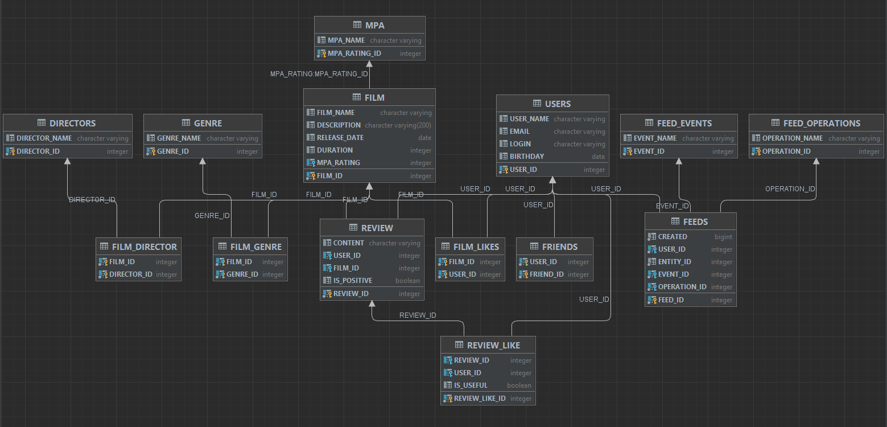

# java-filmorate

Схема БД

Сделанные функциональности:
- Удаление фильмов и пользователей
- Добавление режиссёров в фильмы
- Вывод самых популярных фильмов по жанру и годам
- Функциональность «Рекомендации»
- Функциональность  «Отзывы»
- Функциональность «Лента событий»
- Функциональность «Поиск»
- Функциональность «Общие фильмы»